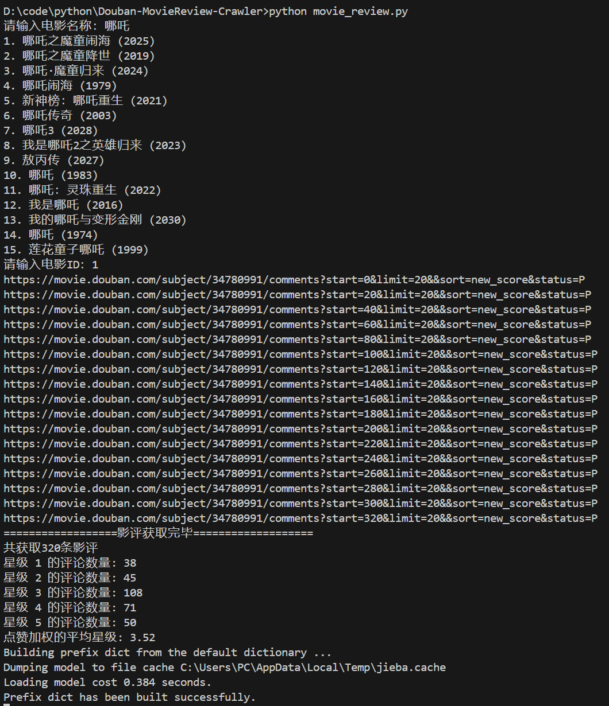

# 🎬 豆瓣影评爬虫助手 🎬

## 📖 项目介绍

欢迎来到豆瓣影评爬虫助手项目！

这个项目旨在帮助电影爱好者和分析者获取豆瓣上的影评数据，并进行深入分析。通过这个项目，你可以轻松地对感兴趣的电影进行影评数据抓取、分析，不仅可以看到影评的星级分布，还能查看根据点赞数加权后的平均星级评分，同时生成有趣的词云图，让电影的评价一目了然。📊 

**提醒**
- 网页端好像最多只展示400条影评，所以单部电影最多只能爬400条数据。
- cookies值存储的登录信息，一段时间后会过期。如果只能爬120条数据说明要更新cookies值。

## ⭐️ 项目展示

### 代码运行效果



### 影评数据示例

```json
{
  "name": "渡心.",
  "content": "邱泽的演技是真好，不愧是影帝，从台词肢体语言最厉害的是眼神戏，书里的陈铭生从纸片人上了大银幕被演出来了，电影非常好看，冲冲冲",
  "upvote": "145",
  "time": "2024-11-09 10:57:55",
  "location": "山东",
  "stars": "5"
}
```

### 词云图示例


## 🚀 功能亮点

- **影评数据抓取**：一键获取指定电影的影评数据。
- **数据分析**：统计不同星级的评论数量，计算点赞加权平均星级。
- **词云图生成**：直观展示影评中的高频词汇。
- **数据保存**：保存影评数据和生成的词云图到本地文件。

## 🛠 使用方式

1. **安装依赖**  
   首先，请确保你的环境中已安装所需的 Python 库。可以通过以下命令安装：

   ```bash
   pip install -r requirements.txt
   ```

2. **运行代码**：在终端或命令行中运行以下命令：
   ```bash
   python movie_review.py
   ```
3. **输入电影名称**：根据提示输入你感兴趣的电影名称。
4. **选择电影 ID**：从返回的电影列表中选择对应的 ID，进行影评爬取。
5. **查看结果**：影评数据将保存在`./data/{movie_name}/comments.json`文件中，词云图保存在`./data/{movie_name}/wordcloud.png`文件中。

## 📊 数据分析

- **星级统计**：输出不同星级的评论数量。
- **加权平均星级**：根据影评点赞数计算加权平均星级。
- **词云图生成**：生成影评中高频词汇的词云图。

## 📁 文件结构

- `./data/{movie_name}/comments.json`：存储爬取的影评数据。
- `./data/{movie_name}/wordcloud.png`：存储生成的词云图。

##❗ 问题与反馈

如果在项目使用过程中遇到任何问题，或者有好的建议和想法，欢迎提出 [issue](https://github.com/king-wang123/Douban-MovieReview-Crawler/issues)。作者会及时查看并处理。👀

## 🌟 支持作者

如果你觉得这个项目对你有帮助，欢迎点击 star 支持作者！你的支持是作者持续更新和改进项目的动力！💪

---

希望这个项目能让你的电影分析之旅更加轻松愉快！🎉
